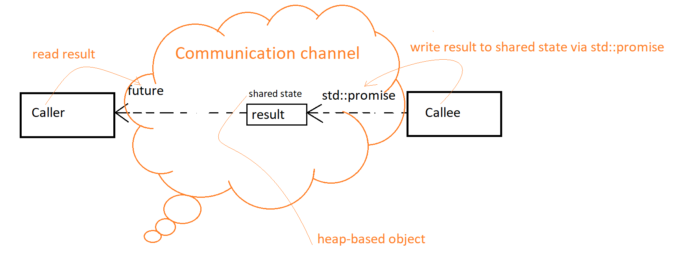

# Futures and Promises

Let us have a closer look to few concepts before diving into this item:
  
 
* The callee writes the result of its computation into the channel via `std::promise`
* The caller reads that result using `future`
* Result is stored outside of both `promise` and `future`, i.e., *shared state*

```c++
#include <thread>
#include <future>
#include <iostream>
 
void sum(int x, int y, std::promise<int> sum_promise) {
    int sum = x + y;
    sum_promise.set_value(sum);  // Notify future
}
 
int main() {
    int x = 1; int y = 2; std::promise<int> sum_promise; // params to sum() function
    std::future<int> sum_future = sum_promise.get_future(); //engagement with future
    
    std::thread t(sum, x, y, std::move(sum_promise));
                            
    sum_future.wait();
    std::cout << "sum=" << sum_future.get() << '\n';
    t.join();
}
/*Output:
sum=3
*/
```

More complicated example:
```c++
#include <vector>
#include <thread>
#include <future>
#include <numeric>
#include <iostream>
 
void accumulate(std::vector<int>::iterator first,
                std::vector<int>::iterator last,
                std::promise<int> accumulate_promise) {
    int sum = std::accumulate(first, last, 0);
    accumulate_promise.set_value(sum);  // Notify future
}
 
int main() {
    std::vector<int> numbers = { 1, 2, 3, 4, 5, 6 };
    //create promise
    std::promise<int> accumulate_promise;
    //engagement with future
    std::future<int> accumulate_future = accumulate_promise.get_future();
    
    std::thread work_thread(accumulate, numbers.begin(), 
                            numbers.end(), std::move(accumulate_promise));
                            
    accumulate_future.wait();           // wait for result
    std::cout << "result=" << accumulate_future.get() << '\n';
    work_thread.join();                 // wait for thread completion
}
/*Output
result=21
*/
```
Source: https://people.cs.pitt.edu/~xianeizhang/notes/Concurrency.html

# Item 38: Be aware of varying thread handle destructor behavior
Both `std::thread` objects and future objects are considered to be *handles* to system threads. 
They have different destructor behaviors.
* `std::thread` dtor:
  As we learned in item 37, `std::thread` dtor of a joinable thread causes the program to terminate. So, we need to *make `std::thread` unjoinable on all paths*. There is no such implicit join nor implicit detach of `std::thread` dtor.
* future dtor:
  As opposite to `std::thread` dtor, future dtor can be implicit join, or implicit detach, or neither of these. Therefore, future dtor never causes the program to terminate.

The behavior of `std::future`'s dtor is determined by the shared state associated with the future.
* "The dtor for the last future referring to a shared state for a non-deferred task launched via `std::async` blocks until the task completes."
* "The dtor for all other futures simply destroys the future object."

So, future's dtor destroys the future object (future's data members); it also decreases reference count of shared state.

Exceptions:
* "It refers to a shared state that was created due to a call to `std::async`."
* "The task's launch policy is `std::launch::async`."
* "The future is the last future referring to the shared state."

//TODO

## Things to remember:
* Future destructors destroy the future's data members
* Final future - shared state - non-deferred task (std::async) blocks until the task completes
